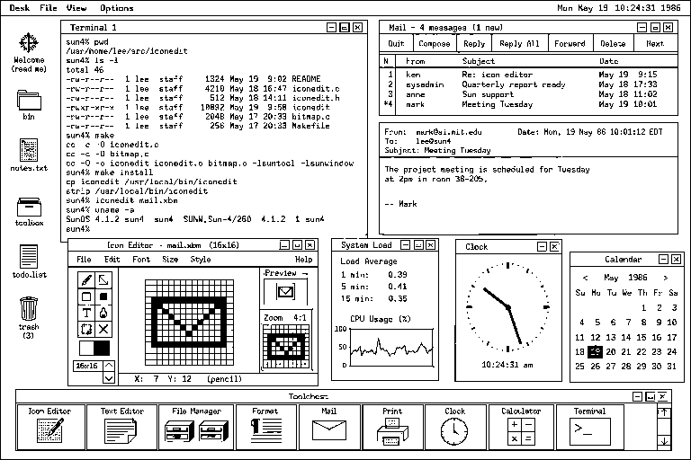
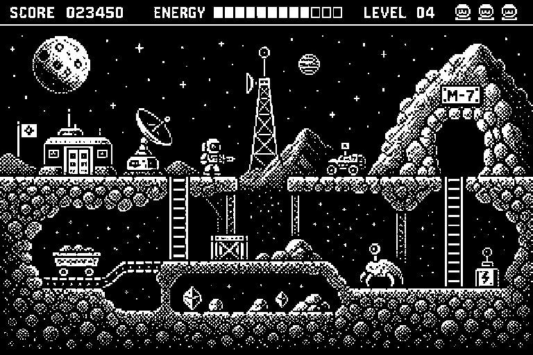
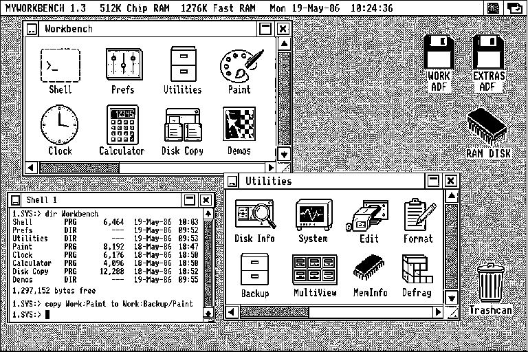
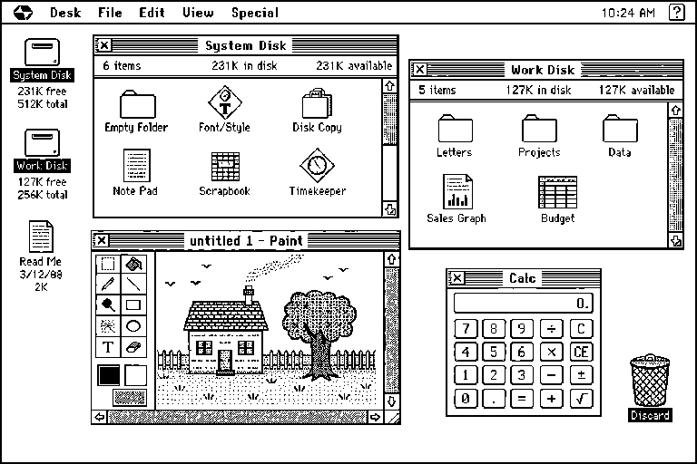

# Retro LCD Studio

A tactile WebGPU pixel studio for creating and rendering crisp monochrome artwork like a classic LCD.

Shape the pixels in physical millimetres, tune their spacing and shadow, try a few display palettes, tilt the infinite screen, or switch to Edit mode and draw directly on it.

**[Open Retro LCD Studio →](https://ixoo.github.io/retro-lcd-studio/)**

## Run it locally

You’ll need Node.js 22.13 or newer and a browser with WebGPU support.

```bash
npm install
npm run dev
```

Then open [localhost:3000](http://localhost:3000).

## Controls

- **View / Edit / Live** switches between presenting, drawing, and animated overlays.
- **Drag** tilts the display in View mode or uses the active tool in Edit mode.
- **Shift-drag** pans, and the **mouse wheel** zooms.
- **Open** imports an image as a 1:1 LCD bitmap.
- **Export** saves the current view as a PNG.

## Demo bitmaps

The project includes four detailed 768 × 512, true 1-bit PNGs inspired by distinct eras of vintage computing:

Their editable sources are plain-text, two-color XPM files in `art/demos`. Run `npm run generate:demos` to rebuild the PNGs without scaling, antialiasing, or color conversion.

| UNIX workstation | Retro gaming |
| --- | --- |
|  |  |

| Commodore-era desktop | Compact Apple-era desktop |
| --- | --- |
|  |  |

The project is still evolving. Ideas, experiments, and contributions are very welcome.
